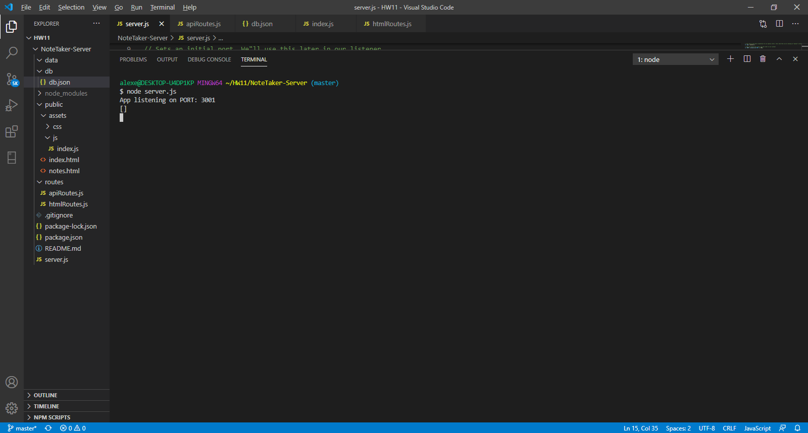

# NoteTaker

## Description
For users that need to keep track of a lot of information, it's easy to forget or be unable to recall something important. Being able to take persistent notes allows users to have written information available when needed.
This application can be used to write, save, and delete notes. This application uses an express backend to save and retrieve note data from a JSON file.
## Usage
User may write and save notes. User may also delete notes that are no longer neccessary to them.
To open application - run 'node server.js' and terminal will return 'App listening on PORT: 3001'. Finally, open 'localhost:3001' in user browser to access application.

## Installation Instructions
User must install node modules and express.
## Questions

[Visit my repository!](https://www.github.com/alexemrob)

For any further questions email me at AlexEmRob@gmail.com
